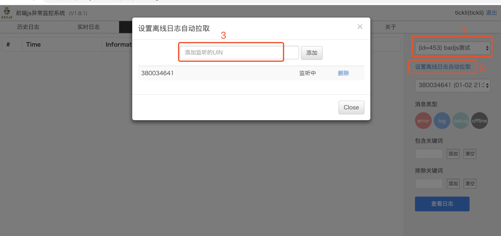

[](https://www.npmjs.org/package/wardjs-report)
[](https://npmjs.org/package/wardjs-report)
[](https://github.com/iv-web/wardjs-report/blob/master/LICENSE)
[](https://github.com/iv-web/wardjs-report/pulls)


## wardjs-report

wardmonitor 日志上报:

错误日志收集，实时日志监控，离线日志统计，前端性能监控 - 基于 badjs 升级的 wardjs-report 给你一站式前端日志监控体验。

## Install 

```shell
$ npm install wardjs-report
```

## Getting started

- npm

```javascript
import WardjsReport from 'wardjs-report'

const wardjs = new WardjsReport({id: 1})

wardjs.report('error msg') // 主动上报
```

- browser

```javascript
const WardjsReport = window['wardjs-report'].default
const wardjs = new WardjsReport({
    id: 1,
    uin: '380034641',
    offlineLog: true,
    offlineLogAuto: true
})
```

### 参数说明

上报 id 需要去 badjs 服务申请

| 参数名 | 默认值 | 简介 |
| --- | --- | --- | 
| id | 0 | 上报id |
| uin | 0 |  user id |
| version | 0 | 上报版本号 |
| url | '//now.qq.com/badjs' | 上报接口 |
| ext | null |  扩展参数 用于自定义上报 |
| level | 4 |  错误级别 1-debug 2-info 4-error |
| ignore | [] | 忽略某个错误, 支持 Regexp 和 Function |
| random | 1 |  抽样 (0-1] 1-全量 |
| delay | 1000 |  延迟上报时间 |
| submit | null |  自定义上报方式 |
| repeat | 5 |  重复上报次数(对于同一个错误超过多少次不上报) |
| offlineLog | false | 是否开启离线日志 |
| offlineLogExp | 5 |  离线日志过期时间，默认5天 |
| offlineLogAuto | false | 是否自动询问服务器需要自动上报 |

### 上报接口


```javascript
wardjs.report(msg, true) // 上报错误事件，true 表示立即上报
wardjs.info(msg) // 上报 info 事件
wardjs.debug(msg) // 上报 debug 事件
wardjs.addOfflineLog(msg)  // 增加离线日志
wardjs.reportOfflineLog() // 上报离线日志
```


### 离线日志用法

- 首先开启离线日志

```javascript
const wardjs = new WardjsReport({
    id: 1,
    offlineLog: true,
    offlineLogAuto: true
})
```

1. offlineLog 表示开启离线日志，将用户日志存储在 IndexDB 中
2. offlineLogAuto 表示每次页面刷新的时候主动询问服务器是否上传离线日志

- 打开 badjs 离线日志页面 http://badjs2.ivweb.io/user/offlinelog.html

选择对应项目的离线日志，按照图示三步走即可




- 刷新项目页面（如果是mobile app则需要重新进入页面）

再次回到 badjs 离线日志页面，在右边栏选择对应的离线日志即可预览了，日志的过滤条件（消息类型，关键词）依然有效。


## wardjs-report 原理

### window.onerror 

关于错误处理的部分是通过重新 window.onerror 实现的，记得在 script 中添加跨域脚本 crossorigin="anonymous" 以帮助 wardjs 捕获错误。

```html
<script type="text/javascript" src="//s.url.cn/aaa.js" crossorigin="anonymous"></script>
```

webpack 打包的项目可以使用 [html-webpack-plugin-crossorigin](https://github.com/liyincheng/html-webpack-inject-attributes-plugin)。

### 离线日志

通过封装 IndexDB 存储用户全部日志，包括对日志的过期处理以及上传操作。具体实现可以查看 `src/Offline.js`。


### 前端性能监控

前端性能监控使用 [performance.timing](https://developer.mozilla.org/zh-CN/docs/Web/API/Performance)。// @todo

## 数据上报

默认使用 [navigator.sendBeacon](https://developer.mozilla.org/zh-CN/docs/Web/API/Navigator/sendBeacon) 上报数据，异步上报，不会因浏览器页面的卸载而影响上报数据，对于不兼容 sendBeacon 的浏览器，使用 Image 上报的方式。


## Build

rollup 打包，支持 tree-shaking，打包后体积只有 8k，是 badjs-report 体积的 1/3。

## License

MIT
